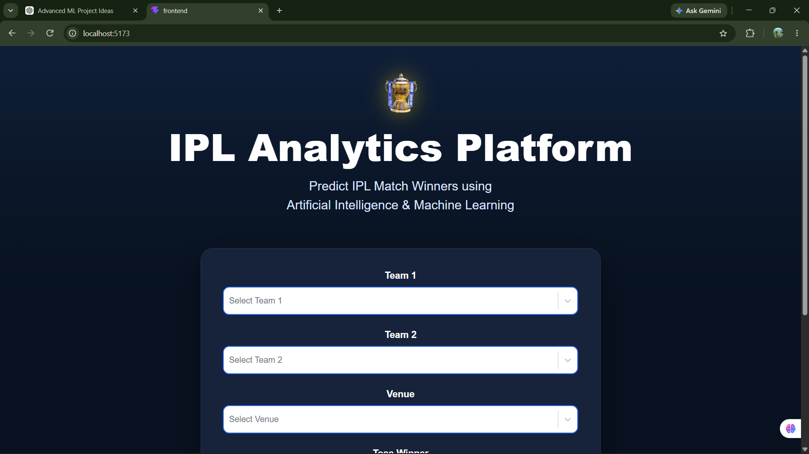
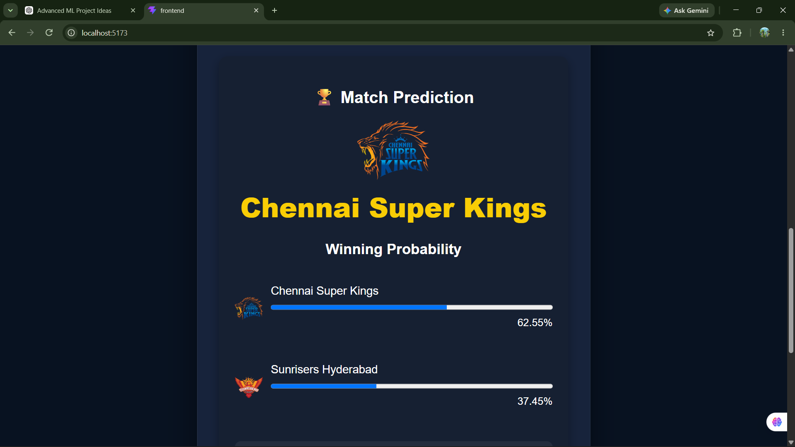

# 🏏 IPL Match Winner Prediction

An end-to-end Machine Learning web application that predicts the winner of an IPL match using historical IPL data, feature engineering, CatBoost, FastAPI, and React.

---

# 🚀 Features

- Predict IPL match winner
- Winning probability for both teams
- Team logos
- Venue-based prediction
- Toss winner & toss decision support
- FastAPI REST API
- React frontend
- CatBoost Machine Learning model

---

# 📸 Screenshots

## Home Page



---

## Prediction Result



---

# 🧠 Machine Learning Pipeline

Data Collection

↓

Data Cleaning

↓

Feature Engineering

↓

Model Training (CatBoost)

↓

FastAPI Backend

↓

React Frontend

---

# ⚙️ Tech Stack

### Frontend

- React
- Vite
- CSS
- Axios

### Backend

- FastAPI
- Python
- Pandas
- Joblib

### Machine Learning

- CatBoost
- Scikit-Learn
- Feature Engineering

---

# 📂 Project Structure

```
IPL-match-winner-prediction/

├── backend/
├── frontend/
├── models/
├── data/
├── training_pipeline/
├── artifacts/
└── README.md
```

---

# 🔥 Features Used

- Team Strength
- Recent Form
- Head-to-Head Record
- Venue Strength
- Toss Winner
- Toss Decision

---


## Backend

```bash
cd backend

pip install -r requirements.txt

uvicorn app.main:app --reload
```

---

## Frontend

```bash
cd frontend

npm install

npm run dev
```

---

# 🎯 API Endpoint

POST

```
/predict
```

Returns

```json
{
    "predicted_winner":"Mumbai Indians",
    "team1_probability":68.42,
    "team2_probability":31.58
}
```

---

# 📈 Future Improvements

- SHAP Explainability
- Match Summary
- Docker Support
- Cloud Deployment
- Player Performance Prediction
- Win Probability Graph

---

# 👨‍💻 Author

Bhagath Kapisetty

B.Tech Computer Science (CSBS)

Machine Learning | Data Analytics | AI
